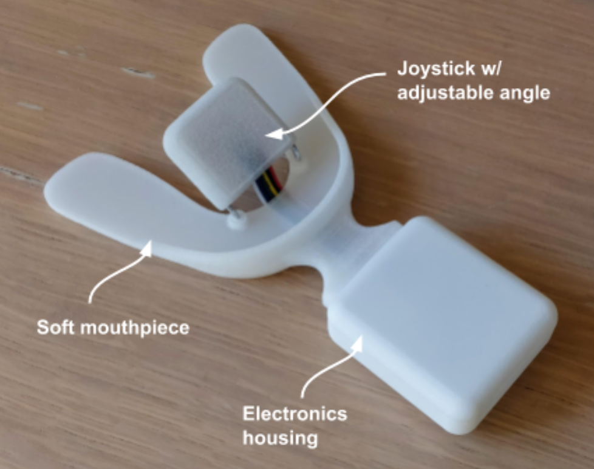
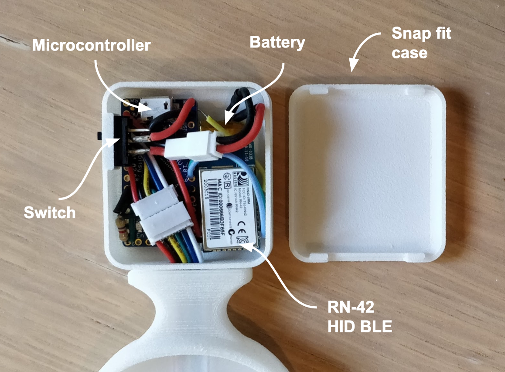

# omni-mouse
An adaptive computer mouse that detects tongue movements to control a cursor. Users include those with quadriplegia or TBI.

Further documentation: [[slides]](https://docs.google.com/presentation/d/1gqfWp77rRQ_fnIK2S10crAoqV5gvX4WOMWYWn-EFgvU/edit?usp=sharing) [[user research report]](https://docs.google.com/document/d/1HK3PQHsJ8Ys6pttRrG1V9VscqA7xPYf28z5V0fU0UI0/edit?usp=sharing)

### Version 1:

 

### Version 2:

