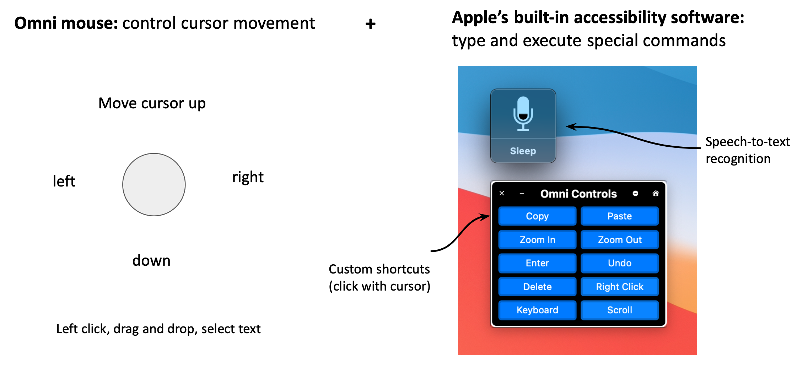

# Version 2

In this iteration, the joystick is placed in front of the lips using a flexible aluminum wire (with the other end attached to a headrest, armrest, or other part of wheelchair). This makes it convenient for the user to move the joystick in and out of the mouth. Users are able to talk more freely, and also use speech-to-text recognition for typing.

Please refer to these [slides](https://docs.google.com/presentation/d/1gqfWp77rRQ_fnIK2S10crAoqV5gvX4WOMWYWn-EFgvU/edit?usp=sharing) for more information.

### Overview:

### Joystick:

### User interface:

